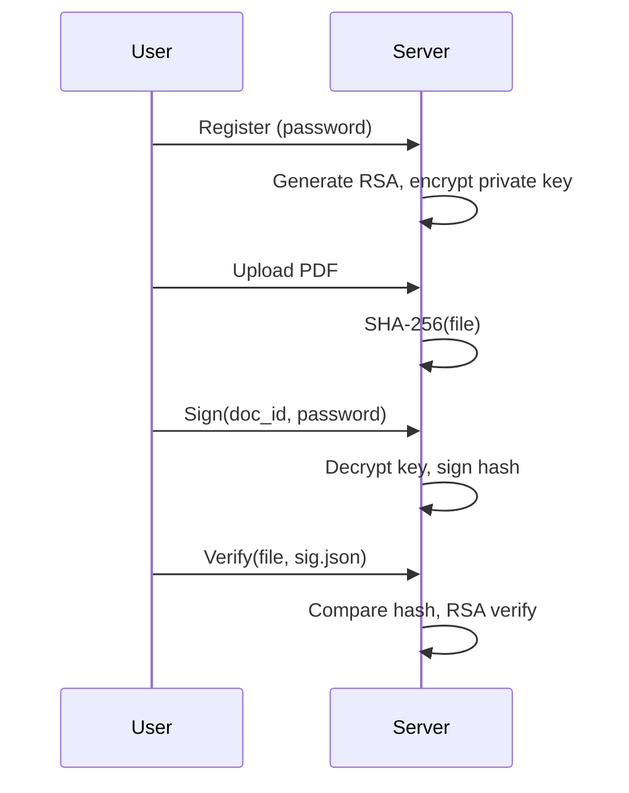

# SignDoc — Sistem Tanda Tangan Digital

Tema 1 UAS Kriptografi Modern: verifikasi keaslian dokumen dan identitas penanda tangan dengan **RSA-2048 + SHA-256**.

## Struktur

| Folder | Isi |
|--------|-----|
| `be/` | Backend FastAPI, SQLite, kriptografi server-side |
| `fe/` | Frontend HTML/JS (demo client-side + aplikasi terintegrasi API) |

## Menjalankan

```bash
cd be
pip install -e .
python main.py
```

Buka:

- **Aplikasi lengkap:** http://127.0.0.1:8000/fe/app.html
- **Demo client-side:** http://127.0.0.1:8000/fe/index.html
- **Verifikasi publik (QR):** http://127.0.0.1:8000/fe/verify.html?doc={document_id}

## Fitur Wajib

| Fitur | Implementasi |
|-------|----------------|
| Registrasi + key pair RSA | `POST /api/auth/register` — privat dienkripsi PBKDF2+Fernet dengan password |
| Upload dokumen + hash | `POST /api/documents/upload` — SHA-256 atas byte file |
| Tanda tangan | `POST /api/documents/{id}/sign` — PKCS#1 v1.5 + Prehashed(SHA-256) |
| Verifikasi | `POST /api/verify` — unggah dokumen + `.sig.json` → VALID/INVALID + detail |
| Riwayat | `GET /api/documents/history` |

## Fitur Pengembangan (nilai A)

- **Multi-signer:** beberapa user menandatangani dokumen yang sama (`signatures` UNIQUE per user)
- **QR verifikasi:** setelah sign, QR menuju `verify.html?doc=...` (tanpa login)
- **Notifikasi modifikasi:** flag `tampered` jika hash file ≠ hash saat upload/sign
- **Export PDF:** `POST /api/verify/report-pdf`

## Jawaban Pertanyaan Kriptografi (untuk laporan)

### Mengapa RSA-2048 (bukan ECDSA)?

RSA dipilih karena interoperabilitas luas, mudah dijelaskan di laporan, dan dukungan library matang. **ECDSA** (mis. P-256) menghasilkan kunci/signature lebih pendek dengan keamanan setara per bit, tetapi kurva dan format signature lebih rumit untuk tim pemula. Keduanya cocok untuk signing; RSA lebih lambat untuk sign/verify, ECDSA lebih efisien di perangkat lemah.

### Mengapa hash dulu, bukan sign seluruh dokumen?

1. **Efisiensi** — RSA hanya memproses blok kecil (hash 32 byte), bukan megabyte PDF.
2. **Keamanan praktis** — skema encrypt/sign langsung pada data panjang rentan (padding oracle, batasan ukuran).
3. **Separation** — hash function (SHA-256) dan signature scheme (RSA) dapat dianalisis terpisah.

### Jika kunci privat bocor?

Signature **lama tetap valid** secara kriptografis (dibuat dengan kunci yang sah saat itu), tetapi penyerang bisa **memalsukan** tanda tangan baru. Mitigasi: rotasi kunci, pencabutan, timestamp/CA, dan tidak menandatangani lagi dengan kunci yang bocor.

### Mengapa SHA-256, bukan MD5?

MD5 punya kerentanan collision praktis — penyerang bisa membuat dua file berbeda dengan hash sama, merusak integritas dokumen. SHA-256 masih dianggap aman untuk integritas dokumen standar.

## Alur singkat


